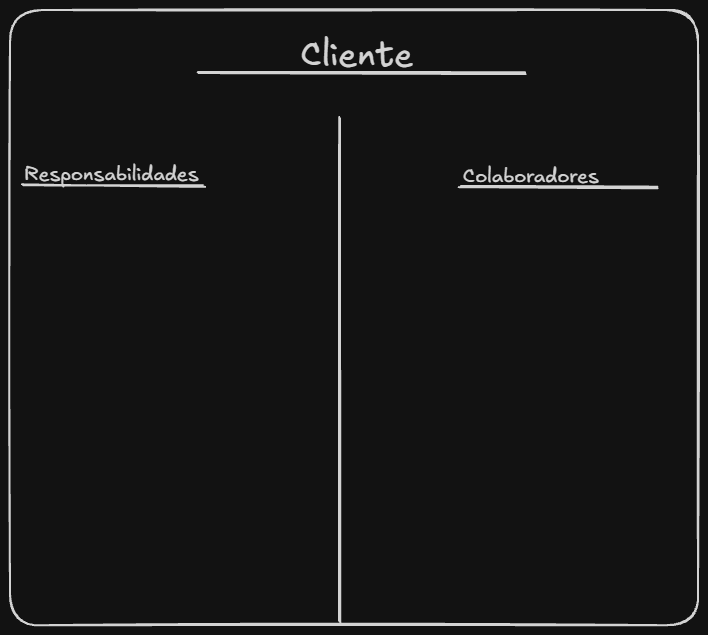

# Tarjeta CRC - Kendall & Kendall

Formulario interactivo para la creación de Tarjetas CRC (Clase, Responsabilidad y Colaboración) basado en la metodología de Análisis y Diseño de Sistemas de Kendall & Kendall.

# Boceto Inicial (Excalidraw)

# Aplicación Web Funcional
Puedes interactuar con el formulario y exportar tus tarjetas a PDF en el siguiente enlace:
 [Ver Tarjeta CRC en GitHub Pages](https://gilberto07-ambeliz.github.io/tarjetas-crc/)
